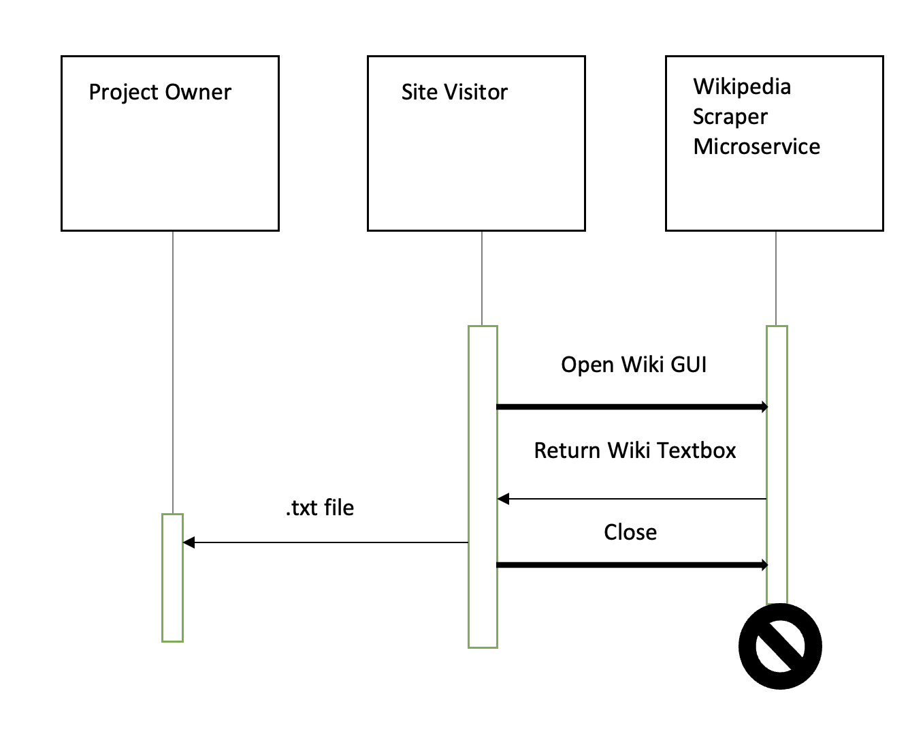

-----------------------------------------------------
Wikipedia Scraper for Game Development Guide Microservice
-----------------------------------------------------
### Python Packages to Install
Open up Terminal.
```
pip install tkinter
pip install wikipedia
```

### How to Start Microservice
Start the service in Terminal.
```
python wiki.py
```
### How to REQUEST Data
Users can request data from this microservice by simply typing in a keyword into the interface’s search engine. It would then match up with the closest-matching Wikipedia article. Here is an example call:

```
from tkinter import *
import wikipedia as wiki

# Clear
def clear():
    my_entry.delete(0, END)
    my_text.delete(0.0, END)


# Search
def search():
    data = wiki.page(my_entry.get())
    # Clear screen
    clear()
    # Output Wikipedia Results to Textbox
    my_text.insert(0.0, data.content)
    
    
>>> [wiki] Pulling information from {data.title}
```


### How to RECEIVE Data
On the same file, there is a function that will gather all of the headings and details of the article from the Wikipedia URL that the user requested. All the user must do is type their keywords in the search engine and the appropriate data should appear on the screen. Said data will also go into a .txt file that the user gets to name of their choice. All .txt. files will go to the ```./information``` directory.

```
# Write to File
def writeFile():
    fileName = input("Article name: ") + ".txt"
    file = open(fileName, 'a+')
    file.write(my_text.get("1.0", 'end-1c') + '\n')
    file.close()


>>> Article name: {write your custom title here}
```

### UML Sequence Diagram


<p align="right">(<a href="#top">back to top</a>)</p>
